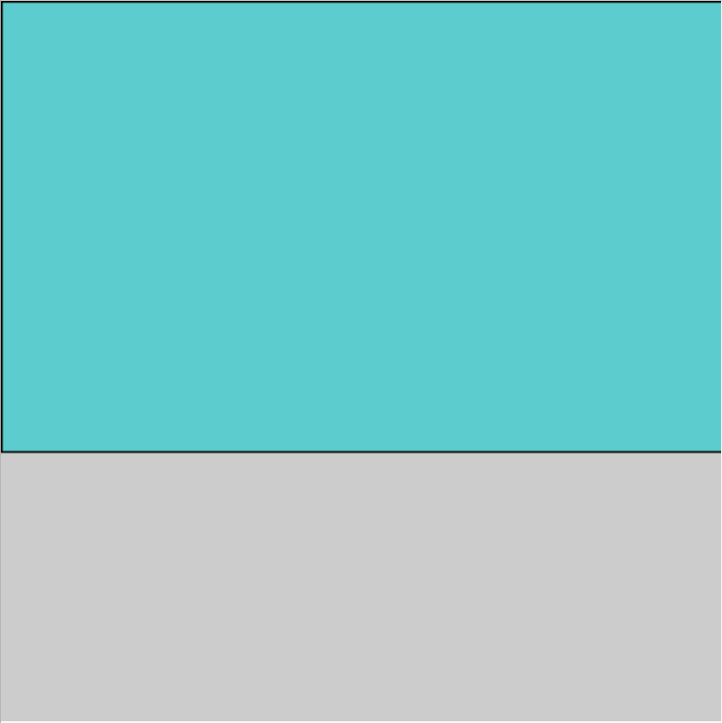

## قم بإنشاء خلفية

Your game needs a colourful background.

! [منطقة مخرجات مع مستطيل بلون السماء فوق مستطيل بلون العشب لإنشاء الخلفية.] (images / background.png) {: "width = "300px}

### Open the starter project

--- task ---

افتح مشروع [بداية الرماية](https://trinket.io/python/eb67937f99){:target="_blank}.

إذا كان لديك حساب Trinket ، فيمكنك النقر فوق الزر **Remix** لحفظ نسخة في مكتبة `My Trinkets`.

--- /task ---

### Edit the sky

--- task ---

The starter project has some code already written for you.

Click **'Run'** to see a blue filled rectangle drawn from x=`0`, y=`0` (the top of the screen). This `400` x `250` pixels rectangle is the sky.

no_stroke()   
fill(sky)   
rect(0, 0, 400, 250) #محور س, محور ص, العرض, الارتفاع

**Tip:** 💡 Coordinates start from (x=0, y=0) in the top left corner. This might be different to other coordinate systems you have used.

--- /task ---

--- task ---

The sky has been drawn with a black border (stroke).

To turn the stroke off for all shapes add `no_stroke()` to the `setup` function:

--- code ---
---
language: python filename: main.py — draw() line_numbers: true line_number_start: 23
line_highlights: 25
---
def setup():
# Setup your game here

    size(400, 400)  # Width and height of screen
    no_stroke()

--- /code ---

--- /task ---

--- task ---

قم بإيقاف تشغيل الحد بإضافة `no_stroke()` قبل أن تبدأ في رسم السماء.

**اختبار:** قم بتشغيل مشروعك مرة أخرى لعرض الخلفية النهائية.

--- /task ---

### Draw the grass

--- task ---

**Add** code to draw a green rectangle at the bottom of the screen.

دالة `size()` تستدعى في `setup()` يعين حجم الشاشة على 400 بكسل × 400 بكسل.

--- code ---
---
language: python filename: main.py — draw() line_numbers: true line_number_start: 18
line_highlights: 26
---
def draw():
# Things to do in every frame

    fill('cyan')  # Set the fill colour for the sky to cyan
    rect(0, 0, 400, 250)  # Draw a rectangle for the sky with these values for x, y, width, height
    fill('lightgreen')  # Set the fill colour for the grass to light green
    rect(0, 250, 400, 150)  # Draw a rectangle for the grass with these values for x, y, width, height

--- /code ---

**اختبار:** قم بتشغيل الكود الخاص بك لرؤية السماء التي رسمتها. You don't need to add comments to your code, but they are helpful to remind you what lines of code do.

--- /task ---

--- task ---

**اختبار:** قم بتشغيل مشروعك مرة أخرى لعرض الخلفية النهائية.

{:width="300px"}

--- /task ---

--- save ---