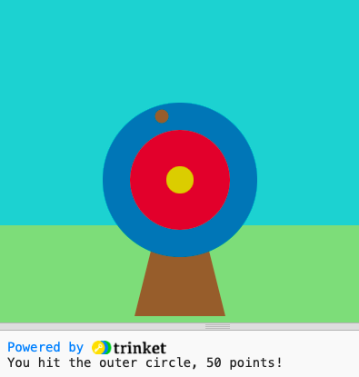
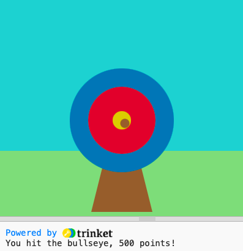

## تسجيل النقاط

<div style="display: flex; flex-wrap: wrap">
<div style="flex-basis: 200px; flex-grow: 1; margin-right: 15px;">
في هذه الخطوة ، ستضيف درجات بناءً على مكان وصول السهم.
</div>
<div>

{:"width="300px}

</div>
</div>

--- task ---

سيتم استخدام متغيرات اللون في دالة `draw()` للتحقق من النتيجة في دالة `mouse_pressed()`. للقيام بذلك ، يجب تعيينهم كمتغيرات عامة:

--- code ---
---
language: python 
filename: main.py 
line_numbers: true 
line_number_start: 26
line_highlights: 28
---

def draw():
#أشياء للقيام بها في كل إطار
  global outer, inner, bullseye    
  sky = color(92, 204, 206) #احمر = 92, اخضر = 204, ازرق = 206    
  grass = color(149, 212, 122)    
  wood = color(145, 96, 51)    
  outer = color(0, 120, 180)    
  inner = color(210, 60, 60)   
  bullseye = color(220, 200, 0)

--- /code ---

--- /task ---

<p style="border-left: solid; border-width:10px; border-color: #0faeb0; background-color: aliceblue; padding: 10px;">
نحن نستخدم <span style="color: #0faeb0; font-weight: bold;"> شروط</span> طوال الوقت لاتخاذ القرارات. يمكننا أن نقول 'إذا كان القلم غير حاد ، فقم جعله حادا'. وبالمثل ، تتيح لنا شروط `if` كتابة رمز يقوم بشيء مختلف اعتمادًا على ما إذا كان الشرط صحيحًا أم خطأ.
</p>

--- task ---

`print` رسالة للدائرة الخارجية للهدف ، أضف رمزًا لوظيفة `mouse_pressed()` للتحقق مما إذا كانت `hit_color` هي `==` إلى `outer`.

كن حذرًا عند استخدام الرمز `=` في بايثون:
 + `=` يستخدم من أجل **تخصيص** - مثل `arrow_x = 200` لتعيين قيمة متغير
 + `==` يستخدم لاختبار **تكافؤ** - مثل `hit_color == bullseye` - إذا كانت الأشياء على كلا الجانبين لها نفس القيمة ، فإن الاختبار هو `True`، وإلا فهو `False`

قم بتغيير التعليمات البرمجية الموجود في `print()` لإعطاء درجة:

--- code ---
---
language: python 
filename: main.py - mouse_pressed() 
line_numbers: true 
line_number_start: 8
line_highlights: 10-11
---

#تذهب دالة mouse_pressed هنا
def mouse_pressed():     
  if hit_color == outer:      
    print('You hit the outer circle, 50 points!') #Like دالة ، يتم وضع مسافة بادئة لعبارات 'if'

--- /code ---

--- /task ---

--- task ---

**اختبار:** قم بتشغيل مشروعك. حاول إيقاف السهم الموجود على الدائرة الخارجية الزرقاء لرؤية رسالتك. لون البكسل الموجود في وسط السهم هو اللون الذي يتم حفظه والتحقق منه.

**نصيحة:** `frame_rate()`، في `setup()`، يتحكم في مدى سرعة رسم لعبتك. إذا كان الأمر سريعًا جدًا ، فاضبطه على رقم أقل.



**تصحيح:** تأكد من تطابق التعليمات البرمجية تمامًا وقمت بوضع مسافة بادئة التعليمات البرمجية داخل عبارة `if`. تخبر المسافة البادئة Python أنه يجب تشغيل الكود فقط إذا كان الشرط `True`.

--- /task ---

نظرًا لأنه سيتم تسجيل النقاط إذا هبط السهم على الدائرة `inner` أو `bullseye` أيضًا ، فإن دوائر`outer` ليست الدائرة الوحيدة التي تحتاج إلى التحقق منها. للقيام بذلك ، استخدم `elif` (نسخة مختصرة من else - if).

<p style="border-left: solid; border-width:10px; border-color: #0faeb0; background-color: aliceblue; padding: 10px;">
نستخدم <span style="color: #0faeb0; font-weight: bold;"> else - if </span> لاتخاذ القرارات في الحياة الواقعية. عندما ترسم صورة للسماء ، قد تتحقق مما إذا كان هناك طلاء أصفر للشمس. عدا ذلك ، إذا لم يكن هناك طلاء أصفر ، فابحث عن اللون البرتقالي. بخلاف ذلك ، إذا لم يكن هناك طلاء أصفر أو برتقالي ، فيمكنك استخدام اللون الأحمر - بشكل خفيف حقًا!
</p>

--- task ---

لا يمكن استخدام `elif` إلا مع عبارة `if` ، ومثل `if`، يتحقق الشرط. إذا كان الشرط `True`، فإن `elif` يقوم بتشغيل بعض التعليمات البرمجية.

ما يجعل `elif` مختلفًا هو أنه سيتم فقط التحقق مما إذا كانت شروط `if` وأي `elif` قبل أن تكون `False`.

أضف عبارة `elif` لـ `inner` و `bullseye`.

--- code ---
---
language: python 
filename: main.py - mouse_pressed() 
line_numbers: true 
line_number_start: 9
line_highlights: 12-15
---

def mouse_pressed():    
  if hit_color == outer:    
    print('You hit the outer circle, 50 points!')    
  elif hit_color == inner:    
    print('You hit the inner circle, 200 points!')   
  elif hit_color == bullseye:    
    print('You hit the bullseye, 500 points!')

--- /code ---

--- /task ---

--- task ---

**اختبار:** قم بتشغيل مشروعك. حاول إيقاف السهم الموجود على الدوائر الحمراء والصفراء لرؤية رسائلهم.



**تصحيح الأخطاء:** تأكد من أن `elif` في نفس مستوى المسافة البادئة مثل `if`، وأن الكود الموجود داخل `elif` في نفس مستوى الرمز الموجود داخل `if`.

**التصحيح:** إذا رأيت رسالة حول `inner` or `bullseye` كونها 'غير محددة' ، فارجع إلى `draw()` وتأكد من أنها على السطر الذي يعلن عن المتغيرات عامة.

```python
global outer, inner, bullseye
```

--- /task ---

هناك قرار آخر يتعين عليك اتخاذه: ماذا يحدث إذا لم يسقط السهم على أي من الدوائر المستهدفة؟ لإجراء هذا الفحص الأخير ، يمكنك استخدام `else`.

<p style="border-left: solid; border-width:10px; border-color: #0faeb0; background-color: aliceblue; padding: 10px;">
نستخدم  <span style="color: #0faeb0; font-weight: bold;"> if … else </span> لاتخاذ القرارات. عندما تستيقظ ، تتحقق وإذا كان الصباح تستيقظ ، أو تعود للنوم. هل يمكنك التفكير في أي قرارات أخرى تتخذها؟ 
</p>

--- task ---

أضف الكود إلى `print` رسالة `else` لم يتم استيفاء أي من عبارات `if` و `elif`.

--- code ---
---
language: python 
filename: main.py 
line_numbers: true 
line_number_start: 9
line_highlights: 16-17
---

def mouse_pressed():    
  if hit_color == outer:   
    print('You hit the outer circle, 50 points!')   
  elif hit_color == inner:   
    print('You hit the inner circle, 200 points!')   
  elif hit_color == bullseye:    
    print('You hit the bullseye, 500 points!')   
  else:   
    print('You missed! No points!')

--- /code ---

--- /task ---

--- task ---

**اختبار:** قم بتشغيل مشروعك. حاول إيقاف السهم في العشب أو السماء لرؤية الرسالة المفقودة. قم بتغيير عدد النقاط المسجلة للألوان المختلفة إذا أردت.


--- /task ---

--- save ---
