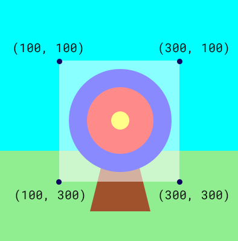

## Feuere deinen Pfeil ab

Wenn du klickst oder tippst, wird ein Pfeil auf die Position eines sich bewegenden Zielkreises abgefeuert. 

{:width="300px"}

### Zeichne in jedem Frame einen Zielkreis

 Computer erzeugen den Bewegungseffekt, indem sie viele Bilder nacheinander anzeigen. Jedes Bild wird als  Frame  (deutsch: „Einzelbild“) bezeichnet.   

--- task ---

Definiere deine Funktion `schiess_pfeil()` unter dem Kommentar **# Die Funktion „schiess_pfeil“ kommt hierher**.

Füge Code hinzu, um zufällig einen braunen Kreis innerhalb eines Zielbereichs zu zeichnen:

--- code ---
---
language: python filename: main.py — shoot_arrow() line_numbers: true line_number_start: 7
line_highlights: 8-12
---
# Die Funktion „schiess_pfeil“ kommt hierher
def shoot_arrow():   
arrow_x = randint(100, 300)  # Store a random number between 100 and 300    
arrow_y = randint(100, 300)  # Store a random number between 100 and 300    
fill('sienna')  # Set the arrow to fill colour to brown   
circle(arrow_x, arrow_y, 15)  # Draw a small circle at random coordinates

--- /code ---

--- /task ---

--- task ---

Finde die Funktion `draw` (deutsch: „Zeichne“) und rufe dort deine neue Funktion `schiess_pfeil` auf.

--- code ---
---
language: python filename: main.py — draw() line_numbers: true line_number_start: 31
line_highlights: 33
---

    fill('yellow')  # Set the colour for the circle fill to yellow      
    circle(200, 200, 30)  # Draw the middle circle using x, y, width
    shoot_arrow()

--- /code ---

--- /task ---

--- task ---

**Test:** 🔄 Führe deinen Code aus und sieh, wie der Pfeil in jedem Frame an einer zufälligen Position erscheint.

Der Hintergrund und die Zielscheibe werden über den alten Pfeil gezeichnet. Das bedeutet, dass du immer nur einen Pfeil siehst.

--- /task ---

### Hol dir die Farbe, die vom Pfeil getroffen wird

Die Funktion `get()` (deutsch: „holen“) gibt die Farbe eines Pixels zurück.

Ein Pixel ist ein einzelner farbiger Punkt innerhalb eines Bildes. Bilder bestehen aus vielen farbigen Pixeln.

--- task ---

Füge eine **globale Variable** mit dem Namen `getroffene_farbe` hinzu, die im gesamten Code verwendet werden kann.

Füge Code zu `get` hinzu, um die Farbe des Pixels in der Mitte des Pfeils zu erhalten, und sie in der Variablen `getroffene_farbe` zu speichern. Um die Farben vergleichen zu können, müssen wir den Hexadezimalcode verwenden. Dies kann mit der Zeichenfolge `.hex` erfolgen.

--- code ---
---
language: python filename: main.py — shoot_arrow() line_numbers: true line_number_start: 7
line_highlights: 9, 12
---
# Die Funktion „schiess_pfeil“ kommt hierher
def shoot_arrow(): global hit_colour  # Can be used in other functions  
arrow_x = randint(100, 300)  # Store a random number between 100 and 300    
arrow_y = randint(100, 300)  # Store a random number between 100 and 300 hit_colour = get(arrow_x, arrow_y).hex  # Get the hit colour     
fill('sienna')  # Set the arrow to fill colour to brown   
circle(arrow_x, arrow_y, 15)  # Draw a small circle at random coordinates

--- /code ---

​**Tipp:** 💡 Der Code in `get` zum Abrufen der Farbe muss **vor** dem Code zum Zeichnen des `circle` (deutsch: „Kreis“) stehen, sonst speicherst du immer die Holzfarbe des Pfeils!

--- /task ---

### Gib die Farbe aus, wenn die Maus gedrückt wird

Die `p5`-Bibliothek „horcht“ auf bestimmte Ereignisse, eines davon ist das Drücken der Maustaste. Wenn sie erkennt, dass die Taste gedrückt wurde, führt es den Code aus, die ihr in der Funktion `mouse_pressed` (deutsch: mouse = Maus, pressed = gedrückt) gegeben wurde.

--- task ---

Definiere deine Funktion `mouse_pressed()` unter dem Kommentar **# Die Funktion „mouse_pressed“ kommt hierher**.

Füge Code hinzu, um das Ziel-Emoji 🎯 auszudrucken, wenn mit der Maus geklickt wird.

--- code ---
---
language: python filename: main.py - mouse_pressed() line_numbers: true line_number_start: 5
line_highlights: 6
---

# Die Funktion „mouse_pressed“ kommt hierher
def mouse_pressed():    
print('🎯')

--- /code ---

--- /task ---

--- task ---

**Test:** 🔄 Führe dein Projekt aus.

Das Projekt gibt jedes Mal 🎯 aus, wenn der Pfeil neu gezeichnet wird.

**Debug:** 🐞 Wenn du eine Meldung siehst, dass `getroffene_farbe` „not defined“ (deutsch: „nicht definiert“) ist, gehe zurück zu `schiess_pfeil()` und überprüfe, ob du die Zeile `global getroffene_farbe` hinzugefügt hast.

**Debug:** 🐞 Überprüfe die `print`-Zeile sehr sorgfältig auf Kommas und Klammern.

--- /task ---

--- save ---
