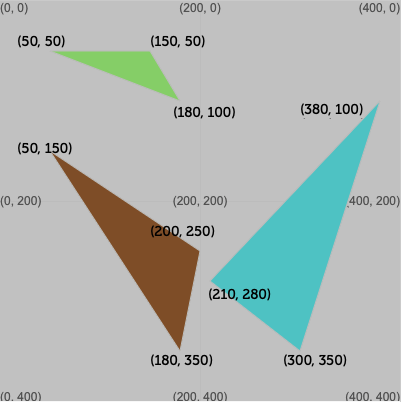

## Σχεδίασε τον στόχο σου

Η βάση του στόχου έχει σχήμα τριγώνου. Ο στόχος αποτελείται από χρωματιστούς κύκλους — οι μικρότεροι κύκλοι αξίζουν περισσότερους πόντους από τους μεγαλύτερους. 

{:width="300px"}

Τα σχήματα σχεδιάζονται με τη σειρά που εκτελούνται οι γραμμές του κώδικα. Η τριγωνική ξύλινη βάση βρίσκεται εν μέρει πίσω από τους κύκλους-στόχους, επομένως πρέπει να σχεδιαστεί πρώτα.

Φαντάσου να κόβεις όλα τα σχήματα από χαρτί. Ανάλογα με τον τρόπο με τον οποίο τακτοποιείς και επικαλύπτεις αυτό το χαρτί, το τελικό αποτέλεσμα μπορεί να φαίνεται πολύ διαφορετικό.

### Σχεδίασε τη βάση

--- task ---

Όταν καλείς τη συνάρτηση `triangle()`, πρέπει να παρέχεις τρία σύνολα συντεταγμένων, `x1, y1, x2, y2, x3, y3` που το καθένα αντιπροσωπεύει τη θέση μιας από τις κορυφές του τριγώνου.

--- collapse ---
---
title: Συντεταγμένες τριγώνων
---

  Ακολουθούν τρία παραδείγματα τριγώνων, το καθένα με διαφορετικά σύνολα συντεταγμένων. Κοίταξε τη θέση του πλέγματος καθενός για να δεις πώς οι συντεταγμένες `x` και `y` τοποθετούν τις κορυφές των τριγώνων:
  + Πράσινο τρίγωνο: triangle(50, 50, 150, 50, 180, 100)
  + Μπλε τρίγωνο: triangle(210, 280, 300, 350, 380, 100)
  + Καφέ τρίγωνο: triangle(50, 150, 200, 250, 180, 350)

  

--- /collapse ---

Σχεδίασε ένα τρίγωνο `()` για τη βάση με κορυφές στα (150, 350), (200, 150) και (250, 350).

--- code ---
---
language: python 
filename: main.py - draw() 
line_numbers: true 
line_number_start: 28
line_highlights: 31-32
---

  fill(grass)   
  rect(0, 250, 400, 150) #x, y, πλάτος, ύψος

  fill(wood) #Ρύθμισε το χρώμα γεμίσματος της βάσης σε καφέ     
  triangle(150, 350, 200, 150, 250, 350)

--- /code ---

**Συμβουλή:** Προσθέσαμε σχόλια στον κώδικά μας, όπως `#Ρύθμισε το χρώμα γεμίσματος της βάσης σε καφέ`, για να σου πούμε τι κάνει η κάθε εντολή. Δεν χρειάζεται να προσθέσεις αυτά τα σχόλια στον κώδικά σου, αλλά μπορεί να είναι χρήσιμα για να σου υπενθυμίζουν τι κάνουν οι γραμμές κώδικα.

--- /task ---

--- task ---

**Δοκιμή:** Εκτέλεσε τον κώδικά σου για να δεις την βάση για τον στόχο σου.

--- /task ---

### Σχεδίασε τον στόχο

--- task ---

Το μεγαλύτερο μέρος του στόχου θα είναι ένας μπλε κύκλος **** που γίνεται χρησιμοποιώντας τη συνάρτηση `ellipse()`. Η έλλειψη είναι ένα σχήμα κλειστό σχήμα χωρίς κορυφές. Μπορεί να είναι πιεσμένο, σαν οβάλ, ή τέλεια στρογγυλό, σαν κύκλος.

Μια έλλειψη χρειάζεται συντεταγμένες `x` και `y`, πλάτος και ύψος. Οι συντεταγμένες `x` και `y` μιας έλλειψης είναι η θέση του κέντρου.

Ο μπλε κύκλος θα καλύψει το καφέ τρίγωνο όπου επικαλύπτονται, επειδή ο κύκλος σχεδιάστηκε αργότερα.

**Συμβουλή:** Για να φτιάξεις έναν κύκλο, το **πλάτος** και το **ύψος** πρέπει να είναι τα ίδια.

--- code ---
---
language: python 
filename: main.py - draw() 
line_numbers: true 
line_number_start: 31
line_highlights: 33-34
---

  fill(wood)   
  triangle(150, 350, 200, 150, 250, 350)   
  fill(outer)    
  ellipse(200, 200, 170, 170) #Εξωτερικός κύκλος. 200, 200 είναι το μέσο της οθόνης

--- /code ---

--- /task ---

--- task ---

**Δοκιμή:** Εκτέλεσε τον κώδικά σου για να δεις τον πρώτο μεγάλο μπλε κύκλο.

--- /task ---

--- task ---

Δημιούργησε δύο νέες μεταβλητές για να αποθηκεύσεις τα χρώματα `inner` και `bullseye` για τους υπόλοιπους κύκλους.

Όρισε τα χρώματα για τις μεταβλητές `inner` και `bullseye` χρησιμοποιώντας τη συνάρτηση `color()`.

Η συνάρτηση `color()` χρειάζεται τρεις αριθμούς: έναν για το κόκκινο, έναν για το πράσινο κι έναν για το μπλε.

Χρησιμοποιήσαμε αριθμούς που εμφανίζουν τα παραδοσιακά χρώματα των στόχων τοξοβολίας, αλλά μπορείς να χρησιμοποιήσεις ό, τι χρώματα θέλεις, αρκεί να είναι διαφορετικά μεταξύ τους.

[[[generic-theory-simple-colours]]]

--- code ---
---
language: python 
filename: main.py - draw() 
line_numbers: true 
line_number_start: 18
line_highlights: 24-25
---

def draw():   
  #Πράγματα που πρέπει να κάνεις σε κάθε καρέ

  sky = color(92, 204, 206)   
  grass = color(149, 212, 122)   
  wood = color(145, 96, 51)   
  outer = color(0, 120, 180) #Μπλε    
  inner = color(210, 60, 60) # Κόκκινο    
  bullseye = color(220, 200, 0) #Κίτρινο

--- /code ---

--- /task ---

--- task ---

Ο στόχος αποτελείται από κύκλους διαφορετικού μεγέθους με τις ίδιες συντεταγμένες του κέντρου (200, 200) — το μέσο της οθόνης.

Πρόσθεσε δύο ακόμη κύκλους για να απεικονίσεις έναν εσωτερικό κύκλο και το κέντρο του στόχου. Άλλαξε το `fill()` πριν σχεδιάσεις κάθε κύκλο.

--- code ---
---
language: python 
filename: main.py - draw() 
line_numbers: true 
line_number_start: 33
line_highlights: 37-40
---

  fill(wood)    
  triangle(150, 350, 200, 150, 250, 350) #Βάση    
  fill(outer)   
  ellipse(200, 200, 170, 170) #Εξωτερικός κύκλος   
  fill(inner)   
  ellipse(200, 200, 110, 110) #Εσωτερικός κύκλος   
  fill(bullseye)   
  ellipse(200, 200, 30, 30) #Κέντρο στόχου

--- /code ---

--- /task ---

--- task ---

**Δοκιμή:** Εκτέλεσε τον κώδικά σου για να δεις τον στόχο με τρεις χρωματισμένους κύκλους. Άλλαξε τα χρώματα μέχρι να είσαι ευχαριστημένος/η με αυτά.

**Εντοπισμός σφαλμάτων:** Η Python χρησιμοποιεί την αμερικανική ορθογραφία του 'color' (χωρίς 'u') οπότε φρόντισε να κάνεις το ίδιο.

--- /task ---

--- save ---

