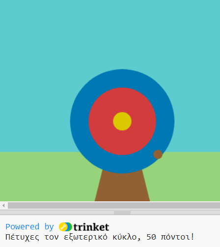
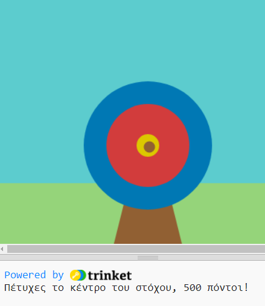

## Κέρδισε πόντους

Σε αυτό το βήμα, θα προσθέσεις πόντους ανάλογα με το σημείο που χτυπάει το βέλος.

{:width="300px"}

We use  conditions all the time to make decisions. We could say 'if the pencil is blunt, then sharpen it'. Similarly, `if` conditions let us write code that do something different depending on whether a condition is true or false.

### Display the scores

--- task ---

Delete ❌ the `print('🎯')` line of code.

--- code ---
---
def draw():
line_highlights: 28
---
# Ενέργειες που πρέπει να γίνονται σε κάθε καρέ
global outer, inner, bullseye    
sky = color(92, 204, 206) #Κόκκινο = 92, Πράσινο = 204, Μπλε = 206    
grass = color(149, 212, 122)    
wood = color(145, 96, 51)    
outer = color(0, 120, 180)    
inner = color(210, 60, 60)   
bullseye = color(220, 200, 0)

--- /code ---

--- /task ---

Χρησιμοποιούμε συνθήκες όλη την ώρα για να λάβουμε αποφάσεις. Θα μπορούσαμε να πούμε «αν το μολύβι δεν είναι μυτερό, τότε πρέπει να το ξύσεις». Similarly, `if` conditions let us write code that do something different depending on whether a condition is true or false.

--- task ---

Για να `εμφανίσεις` μήνυμα για τον εξωτερικό κύκλο του στόχου, πρόσθεσε κώδικα στη συνάρτηση `mouse_pressed()` για να ελέγξεις εάν το `hit_color` είναι `==` με το `outer`.

Να είσαι προσεκτικός/ή όταν χρησιμοποιείς το σύμβολο `=` στην Python:

--- code ---
---
language: python filename: main.py - mouse_pressed() line_numbers: true line_number_start: 5
line_highlights: 10-11
---

# Η συνάρτηση mouse_pressed πηγαίνει εδώ
language: python filename: main.py - mouse_pressed() line_numbers: true line_number_start: 8

--- /code ---

**Tip:** 💡 If you changed the colour of your outer circle then you will need to replace `'blue'` with the colour name that you have chosen.

--- /task ---

--- task ---

**Test:** 🔄 Run your project. Try to fire the arrow on the blue outer circle to see the message.

**Tip:** 💡 `frame_rate=2`, in `run` at the bottom of your code, controls how fast your game draws. If it's going too fast, set it to a lower number.

**Debug:** 🐞 Check that you have used the American spelling of 'Color' (without a 'u') and that 'Color' is capitalised.

**Debug:** 🐞 Make sure your code matches exactly and you indented the code inside your `if` statement.

**Debug:** 🐞 Make sure that you have entered the correct colour name you used for **your** outer circle.

--- /task ---

`elif` (else - if) can be used to add more conditions to your `if` statement. These will be read from top to bottom. As soon as a **True** condition is found, it will be actioned. Any remaining conditions will be ignored.

--- task ---

Αυτό που κάνει το `elif` διαφορετικό είναι ότι θα κάνει αυτόν τον έλεγχο μόνο εάν οι συνθήκες του `if` και οποιωνδήποτε `elif` πριν από αυτό είναι `Ψευδείς`.

--- code ---
---
language: python filename: main.py - mouse_pressed() line_numbers: true line_number_start: 6
line_highlights: 12-15
---

def mouse_pressed(): if hit_colour == Color('blue').hex:   
print('You hit the outer circle, 50 points!') elif hit_colour == Color('red').hex: print('You hit the inner circle, 200 points!') elif hit_colour == Color('yellow').hex: print('You hit the middle, 500 points!')

--- /code ---

--- /task ---

--- task ---

**Test:** 🔄 Run your project. Try to fire the arrow on the inner and middle circles to see their messages.

**Debug:** 🐞 Check your indentation matches the example.

**Εντοπισμός σφαλμάτων:** Βεβαιώσου ότι το `elif` βρίσκεται στο ίδιο επίπεδο εσοχής με το `if`και ο κώδικας μέσα στο `elif` είναι στο ίδιο επίπεδο με τον κώδικα μέσα στο `if`.

**Εντοπισμός σφαλμάτων:** Εάν δεις ένα μήνυμα σχετικά με το ότι το `inner` ή το `bullseye` δεν έχει οριστεί, τότε πρέπει να επιστρέψεις στο `draw()` και να ελέγξεις ότι βρίσκονται στη γραμμή που δηλώνει τις καθολικές μεταβλητές.

**Debug:** 🐞 Make sure that you have used the `.hex` string for **your** circle colours.

--- /task ---

### Missing the target

There is one more decision you need to make: what happens if the arrow does not land on any of the target circles? ❌

To do this last check, you use `else`.

--- task ---

Add code to `print` a message `else` none of the `if` and `elif` statements have been met.

--- code ---
---
language: python filename: main.py line_numbers: true line_number_start: 6
line_highlights: 16-17
---

def mouse_pressed(): if hit_colour == Color('blue').hex:   
print('You hit the outer circle, 50 points!') elif hit_colour == Color('red').hex: print('You hit the inner circle, 200 points!') elif hit_colour == Color('yellow').hex: print('You hit the middle, 500 points!') else:   
print('You missed! No points!')

--- /code ---

--- /task ---

--- task ---

**Test:** 🔄 Run your project. Fire the arrow in the grass or sky to see the miss message.

**Choose:** 💭 Change the number of points scored for the different colours.

--- /task ---

--- save ---
