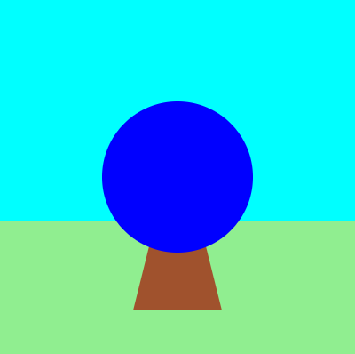

## Draw your target

The target stand is a triangle shape. The target is made with coloured circles — smaller circles are worth more points than larger ones. 

{:width="300px"}

Shapes are drawn in the order that the lines of code run. The triangular wooden stand is partly behind the target circles so it must be drawn first. 

Imagine cutting all the shapes out of paper. Depending on how you arrange and overlap that paper, the final result could look very different.

### Draw the stand

--- task ---

When you call the `triangle()` function, you need to provide three sets of coordinates, `x1, y1, x2, y2, x3, y3` each representing the position of one of the triangle's corners. 

--- collapse ---
---
title: Triangle coordinates
---

  Here are three example triangles, each with different sets of coordinates. Look at the grid position of each to see how the `x` and `y` coordinates position the corners of the triangles:
  + Green triangle: triangle(50, 50, 150, 50, 180, 100)
  + Blue triangle: triangle(210, 280, 300, 350, 380, 100)
  + Brown triangle: triangle(50, 150, 200, 250, 180, 350)
  
  

--- /collapse ---

Draw a `triangle()` for the stand with corners at (150, 350), (200, 150), and (250, 350).

--- code ---
---
language: python
filename: main.py - draw()
line_numbers: true
line_number_start: 28
line_highlights: 31-32
---
  fill(grass)   
  rect(0, 250, 400, 150) #x, y, width, height
  
  fill(wood) #Set the stand fill colour to brown     
  triangle(150, 350, 200, 150, 250, 350)

--- /code ---

**Tip:** We have added comments to our code, like `#Set the stand fill colour to brown`, to tell you what it does. You don't need to add these comments to your code, but they can be helpful to remind you what lines of code do.

--- /task ---

--- task ---

**Test:** Run your code to see the stand for your target. 

--- /task ---

### Draw the target

--- task ---

The largest part of the target will be a blue **circle** made by using the `ellipse()` function. An ellipse is a shape with a single side and no corners. It can be squashed, like an oval, or perfecly round, like a circle. 

An ellipse needs `x` and `y` coordinates, width, and height. The `x` and `y` coordinates of an ellipse are the centre position. 

The blue circle will cover the brown triangle where they overlap, because the circle was drawn later. 

**Tip:** To make a circle, the **width** and **height** must be the same. 

--- code ---
---
language: python
filename: main.py - draw()
line_numbers: true
line_number_start: 31
line_highlights: 33-34
---
  fill(wood)   
  triangle(150, 350, 200, 150, 250, 350)   
  fill(outer)    
  ellipse(200, 200, 170, 170) #Outer circle. 200, 200 is the middle of the screen
  
--- /code ---

--- /task ---

--- task ---

**Test:** Run your code to see the first large blue circle.

--- /task ---

--- task ---

Create two new variables to store colours `inner` and `bullseye` for the remaining circles. 

Assign colours to the `inner` and `bullseye` variables using `color()`.

The `color()` function expects three numbers: one each for red, green, and blue.

We used numbers that give traditional archery target colours, but you can use whatever colours you like as long as they are different from each other.

[[[generic-theory-simple-colours]]]

--- code ---
---
language: python
filename: main.py - draw()
line_numbers: true
line_number_start: 18
line_highlights: 24-25
---
def draw():   
  #Things to do in every frame
  
  sky = color(92, 204, 206)   
  grass = color(149, 212, 122)   
  wood = color(145, 96, 51)   
  outer = color(0, 120, 180) #Blue    
  inner = color(210, 60, 60) # Red    
  bullseye = color(220, 200, 0) #Yellow    

--- /code ---

--- /task ---

--- task ---

The target is made of different-sized circles with the same centre coordinates (200, 200) — the middle of the screen. 

Add two more circles to represent an inner circle and the bullseye. Change the `fill()` before drawing each circle. 

--- code ---
---
language: python
filename: main.py - draw()
line_numbers: true
line_number_start: 33
line_highlights: 37-40
---
  fill(wood)    
  triangle(150, 350, 200, 150, 250, 350) #Stand    
  fill(outer)   
  ellipse(200, 200, 170, 170) #Outer circle   
  fill(inner)   
  ellipse(200, 200, 110, 110) #Inner circle   
  fill(bullseye)   
  ellipse(200, 200, 30, 30) #Bullseye   
--- /code ---

--- /task ---

--- task ---

**Test:** Run your project again to see the target with three coloured circles. Change the colours until you are happy with them.

**Debug:** Python uses the American spelling of 'color' (without a 'u') so make sure you do the same.

--- /task ---

--- save ---

