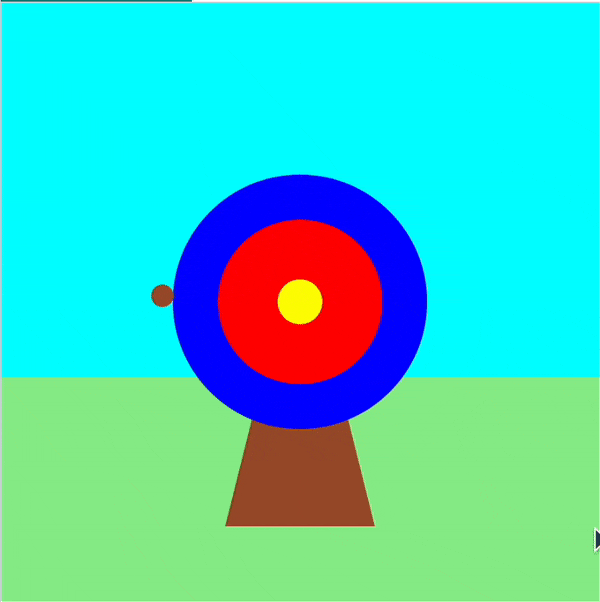

## Where did you hit?

Use a **global variable** called `hit_colour`{:.language-python} to `get()`{:.language-python} the colour at `arrow_x, arrow_y`{:.language-python} when you click. 

### Get the colour hit by the arrow 

--- task ---

Add a **global variable** called `hit_colour` that can be used throughout your code.

Add code to `get` the colour  at the centre of the arrow and store it in the `hit_colour` variable. 

--- code ---
---
language: python
line_numbers: true
line_number_start: 9
line_highlights: 11, 14, 15
---
def shoot_arrow():
    global hit_colour  
    arrow_x = randint(100, 300)  
    arrow_y = randint(100, 300) 
    hit_colour = get(arrow_x, arrow_y).hex
    print(hit_colour)
    fill('brown')
    circle(arrow_x, arrow_y, 15)

--- /code ---

**Tip:** 💡 The code to `get` the colour needs to be **before** the code to draw the `circle` otherwise you will always save the brown colour of the arrow! 

--- /task ---

--- task ---

**Test:** Stop your code from running, then switch to Split View before running your code again. Click the **Run** button. You should see the colours being printed in the **Text output**, in hexadecimal format. 

--- /task ---

### Print the colour when the mouse is pressed

--- task ---
Comment out the line that prints the colour. This means it will not run. 

--- code ---
---
language: python
line_numbers: true
line_number_start: 13
line_highlights: 14
---
    hit_colour = get(arrow_x, arrow_y).hex
    # print(hit_colour)
    circle(arrow_x, arrow_y, 15)
--- /code ---

--- /task ---

--- task ---
Add code to print the target emoji 🎯 when the mouse is clicked.

--- code ---
---
language: python
line_numbers: true
line_number_start: 5
line_highlights: 6-7
---
# The mouse_pressed function goes here    
def mouse_pressed():    
    print('🎯')
--- /code ---

--- /task ---

--- task --- 
**Test:** Click the **Run** button. You should see the 🎯 character printed when you click the mouse.

--- /task ---

--- task --- 

**Test:** 🔄 Run your project. 

The project prints 🎯 each time the arrow is redrawn.

**Debug:** 🐞 If you are seeing a message about `hit_colour` being 'not defined', then go back to `shoot_arrow()` and check that you have included the `global hit_colour` line.

**Debug:** 🐞 Check the `print` line really carefully for commas and brackets. 

--- /task ---

--- save ---