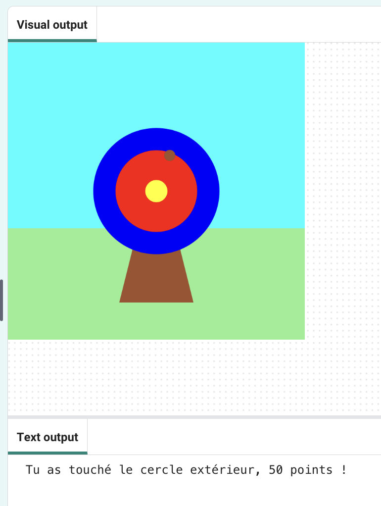

## Marquer des points

Ton jeu ajoutera des scores en fonction de l'endroit où la flèche frappe.

{:width="300px"}

Nous utilisons des  conditions tout le temps pour prendre des décisions. On pourrait dire « si le crayon est émoussé, alors taille-le ». De même, les conditions "if" nous permettent d'écrire du code qui fait quelque chose de différent selon qu'une condition est vraie ou fausse.

### Afficher les scores

--- task ---

Supprime ❌ la ligne de code `print('🎯')` .

--- code ---
---
language: python
filename: main.py
line_numbers: true
line_number_start: 5
line_highlights: 7
---
# La fonction souris_pressee vient ici
def souris_pressee():

--- /code ---

--- /task ---

--- task ---

Affiche un message **if** la `touche_couleur` est égale à la couleur du cercle `extérieur` (bleu) 🎯.

Remarque 👀 que le code utilise deux signes égal `==` pour signifier **égal à**.

--- code ---
---
language: python
filename: main.py - mouse_pressed()
line_numbers: true
line_number_start: 5
line_highlights: 7, 8
---

# La fonction souris_pressee vient ici
def souris_pressee():     
    if touche_couleur == Color('blue').hex: #Comme les fonctions, les instructions "if" sont indentées   
        print('tu as touché le cercle extérieur, 50 points !') 

--- /code ---

**Astuce :** 💡 si tu as modifié la couleur de ton cercle extérieur alors tu devras remplacer `'blue'` par le nom de couleur que tu as choisi.

--- /task ---

--- task ---

**Test :** 🔄 exécute ton projet. Essaie de tirer la flèche sur le cercle extérieur bleu pour voir le message.

**Astuce :** `frame_rate()`, dans `setup()`, contrôle la vitesse à laquelle ton jeu dessine. S'il va trop vite, règle-le sur un nombre inférieur.

**Débogage :** 🐞 vérifie que tu as utilisé l'orthographe américaine de 'Color' (sans 'u') et que 'Color' est en majuscule.

**Debogage :** 🐞 assure-toi que ton code correspond exactement et que tu as indenté le code à l'intérieur de ta déclaration `if`.

**Débogage :** 🐞 assure-toi d'avoir entré le nom de couleur correct que tu as utilisé pour **ton** cercle extérieur.

--- /task ---

`elif` (else - if) peut être utilisé pour ajouter des conditions supplémentaires à ta déclaration `if`. Elles seront lues de haut en bas. Dès qu'une condition **True** est trouvée, elle sera traitée. Toutes les conditions restantes seront ignorées.

--- task ---

Marque des points si la flèche atterrit sur les cercles `interieur` ou `centre` 🎯 :

--- code ---
---
language: python
filename: main.py - mouse_pressed()
line_numbers: true
line_number_start: 6
line_highlights: 9-12
---

def souris_pressee():
    if touche_couleur == Color('blue').hex:   
        print('Tu as touché le cercle extérieur, 50 points !')
    elif touche_couleur == Color('red').hex:
        print('Tu as touché le cercle intérieur, 200 points !')
    elif touche_couleur == Color('yellow').hex:
        print('Tu as touché le centre, 500 points !')

--- /code ---

--- /task ---

--- task ---

**Test :** 🔄 exécute ton projet. Essaie de tirer la flèche sur les cercles intérieurs et intermédiaires pour voir leurs messages.

**Débogage :** 🐞 vérifie que ton indentation correspond à l'exemple.

**Débogage :** 🐞 si tu vois un message indiquant que `touche_couleur` n'est pas « défini », reviens à `draw()` et vérifie que la ligne déclaration `touche_couleur` comme une variable globale.

**Débogage :** 🐞 assure-toi d'avoir entré le nom de couleur correct pour **tes** cercles.

**Débogage :** 🐞 assure-toi d'avoir utilisé la chaîne `.hex` pour **tes** couleurs de cercle.

--- /task ---

### Manquer la cible

Il te reste une décision à prendre : que se passe-t-il si la flèche n'atterrit sur aucun des cercles cibles ? ❌

Pour faire cette dernière vérification, tu utilises `else`.

--- task ---

Ajoute du code à `print` un message `else` si aucune des déclarations `if` et `elif` n'ont été remplies.

--- code ---
---
language: python
filename: main.py
line_numbers: true
line_number_start: 6
line_highlights: 13-14
---

def souris_pressee():    
    if touche_couleur == Color('blue').hex: 
        print('Tu as touché le cercle extérieur, 50 points !')   
    elif touche_couleur == Color('red').hex: 
        print('Tu as touché le cercle intérieur, 200 points !')   
    elif touche_couleur == Color('yellow').hex:   
        print('Tu as touché le centre, 500 points !')
    else:   
       print('Tu as loupé la cible ! Aucun point !')

--- /code ---

--- /task ---

--- task ---

**Test :** 🔄 exécute ton projet. Tire la flèche dans l'herbe ou dans le ciel pour voir le message manqué.

**Choisir :** 💭 modifie le nombre de points marqués pour les différentes couleurs.

--- /task ---

--- save ---
