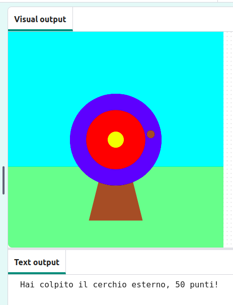

  <a class="c-survey-banner__link" href="https://form.raspberrypi.org/f/code-editor-feedback" target="_blank">Partecipa al nostro sondaggio</a> per contribuire a migliorare il nostro editor di codice!

## Quello che farai

Usa Python, con la libreria grafica `p5` , per disegnare un bersaglio e segnare punti colpendolo con le frecce.

Tu:
 + Personalizzerai il tuo gioco con **i colori RGB**
 + Userai le  **istruzioni condizionali** (`if`, `elif`, `else`) per prendere decisioni
 + Posizionerai le forme utilizzando le **coordinate x, y**

--- no-print ---

### Gioca ▶️

--- task ---

  

Fai clic sul pulsante **Run** in basso per avviare il gioco. Quando appare il punto sul bersaglio 🎯, fai clic con il mouse (o tocca sul tablet) per scoccare la freccia. 

Fai qualche tentativo. Il tuo punteggio viene visualizzato nell'area di output sotto il target. Come cambia il tuo punteggio quando la freccia si ferma sui diversi colori? 
  <iframe src="https://editor.raspberrypi.org/en/embed/viewer/target-practice-solution" width="400" height="710" frameborder="0" marginwidth="0" marginheight="0" allowfullscreen>
  </iframe>

**Suggerimento:** 💡 Quando premi **Interrompi** vedrai un messaggio che dice "Execution interrupted". Ciò significa semplicemente che hai interrotto il programma mentre il codice era ancora in esecuzione.

--- /task ---

--- /no-print ---

--- print-only ---

{:width="640px"}

--- /print-only ---

Le prove più antiche di  tiro con l'arco  provengono dalla grotta di Sibudu nel KwaZulu-Natal, in Sud Africa. Sono stati rinvenuti resti di punte di freccia in pietra e osso, databili tra 60.000 e 70.000 anni fa. 

