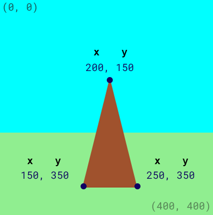

## Disegna il tuo bersaglio

Il tuo gioco ha bisogno di un bersaglio contro il quale lanciare le frecce.

{:width="300px"}

### Disegna un supporto triangolare

--- task ---

Imposta il colore di riempimento su `sienna` (marrone).

Disegna un triangolo utilizzando le coordinate x e y per ciascuno degli angoli.

{:width="400px"}

--- code ---
---
language: python filename: main.py - draw() line_numbers: true line_number_start: 18
line_highlights: 20, 21
---

    fill('lightgreen')  # Set the fill colour for the grass to light green
    rect(0, 250, 400, 150)  # Draw a rectangle for the grass with these values for x, y, width, height
    fill('sienna')  # Brown colour
    triangle(150, 350, 200, 150, 250, 350)  # Draw a triangle for the target's stand

--- /code ---

--- /task ---

--- task ---

**Test:** 🔄 Esegui il codice per vedere il supporto del tuo obiettivo:

{:width="400px"}

--- /task ---

### Disegna i cerchi bersaglio

--- task ---

La parte più grande del bersaglio è un **cerchio** blu.

Imposta il colore di riempimento su `blu`.

Disegna un cerchio con le coordinate x e y per il centro e una larghezza.

{:width="400px"}

--- code ---
---
language: python filename: main.py - draw() line_numbers: true line_number_start: 20
line_highlights: 22, 23
---

    fill('sienna')  # Brown colour
    triangle(150, 350, 200, 150, 250, 350)  # Draw a triangle for the target's stand 
    fill('blue')  # Set the circle fill colour to blue
    circle(200, 200, 170)  # Draw the outer circle

--- /code ---

--- /task ---

--- task ---

**Test:** Esegui il codice per vedere il primo grande cerchio blu.

Il cerchio blu è stato disegnato dopo lo stand, quindi appare davanti.

{:width="400px"}

--- /task ---

Il bersaglio è composto da cerchi di diverse dimensioni ma con le stesse coordinate centrali (200, 200).

--- task ---

**Aggiungi** cerchi colorati per le parti interne e centrali del bersaglio.

--- code ---
---
language: python filename: main.py - draw() line_numbers: true line_number_start: 20
line_highlights: 24, 25, 26, 27
---

    fill('sienna')  # Brown colour
    triangle(150, 350, 200, 150, 250, 350)  # Draw a triangle for the target's stand 
    fill('blue')  # Set the circle fill colour to blue
    circle(200, 200, 170)  # Draw the outer circle
    fill('red')  # Set the colour for the circle fill to red
    circle(200, 200, 110)  # Draw the inner circle using x, y, width
    fill('yellow')  # Set the colour for the circle fill to yellow      
    circle(200, 200, 30)  # Draw the middle circle using x, y, width

--- /code ---

--- /task ---

--- task ---

**Test:** 🔄 Esegui il tuo progetto per vedere il bersaglio con i tre cerchi colorati.

{:width="400px"}

--- /task ---

--- task ---

**Scegli:** 💭 Cambia uno qualsiasi dei colori utilizzando un nome di colore diverso. Puoi trovare un elenco di tutti i nomi dei colori disponibili su [W3 Schools](https://www.w3schools.com/colors/colors_names.asp){:target="blank"}.

{:width="400px"}

--- collapse ---
---
title: codice di esempio che utilizza colori diversi
---

--- code ---
---
language: python filename: main.py - draw() line_numbers: false line_number_start: 14
line_highlights:
---

def draw():
# Cose da fare in ogni fotogramma

    fill('BlueViolet')
    rect(0, 0, 400, 250)  # Sky
    fill('DeepSkyBlue')
    rect(0, 250, 400, 150)  # Ground
    fill('FireBrick')
    triangle(150, 350, 200, 150, 250, 350)  # Stand
    fill('LemonChiffon')
    circle(200, 200, 170)  # Outer circle
    fill('DeepPink')
    circle(200, 200, 110)  # Inner circle
    fill('BlueViolet')
    circle(200, 200, 30)  # Middle circle

--- /code ---

--- /collapse ---

--- /task ---

--- save ---
