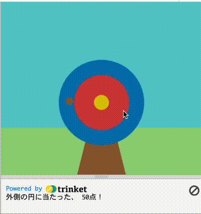
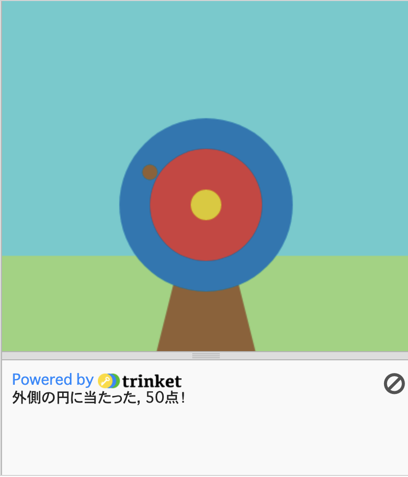

## 得点

このステップでは、矢が当たった場所に応じてスコアを追加します。

{:width="300px"}

私たちは実生活の中で、 else - if  を使って意思決定をしています。 We could say 'if the pencil is blunt, then sharpen it'. Similarly, `if` conditions let us write code that do something different depending on whether a condition is true or false.

### Display the scores

--- task ---

`print()`のコードを変更して、点数を出すようにしてください。

--- code ---
---
language: python filename: main.py line_numbers: true line_number_start: 9
line_highlights: 28
---
# The mouse_pressed function goes here
def draw():

--- /code ---

--- /task ---

私たちは常に条件で判断しています。 「鉛筆の芯がとがっていなければ、削る」と言えます。 同様に、`if`条件では、ある条件が真か偽かによって異なる処理を行うコードを書くことができます。

--- task ---

は**同値**をテストするために使われます - `hit_color == bullseye` のように - もしどちらかの側のものが同じ値であれば、テストは`真`、そうでない場合`偽`になります。

Pythonで`=`記号を使用する場合は、注意が必要です。

--- code ---
---
language: python filename: main.py - mouse_pressed() line_numbers: true line_number_start: 8
line_highlights: 10-11
---

# mouse_pressed関数はここにあります
ターゲットの外側の円に対してメッセージを`print`するには、`mouse_pressed()`関数に、`hit_color``==``outer`になっているかをチェックするコードを追加してください。

--- /code ---

**Tip:** 💡 If you changed the colour of your outer circle then you will need to replace `'blue'` with the colour name that you have chosen.

--- /task ---

--- task ---

**テスト：**プロジェクトを実行します。 赤と黄色の円に矢を止めて、そのメッセージを確認してください。

**ヒント：** `setup()` 内の `frame_rate()` は、ゲームの描画速度を制御します。 速度が速すぎる場合は、小さい数値に設定してください。

`elif`の違いは、`if`とその前の`elif`の条件が`False`のときだけチェックする点です。

`inner`と`bullseye`に`elif`ステートメントを追加しました。

global outer, inner, bullseye    
sky = color(92, 204, 206) #赤 = 92, 緑 = 204, 青 = 206    
grass = color(149, 212, 122)    
wood = color(145, 96, 51)    
outer = color(0, 120, 180)    
inner = color(210, 60, 60)   
bullseye = color(220, 200, 0)

--- /task ---

`elif`は`if`文でのみ使用でき、`if`同様、条件をチェックします。 These will be read from top to bottom. As soon as a **True** condition is found, it will be actioned. Any remaining conditions will be ignored.

--- task ---

Score points if the arrow lands on the `inner` or `middle` circles 🎯:

--- code ---
---
language: python filename: main.py - mouse_pressed() line_numbers: true line_number_start: 9
line_highlights: 12-15
---

def mouse_pressed(): if hit_colour == Color('blue').hex:   
print('You hit the outer circle, 50 points!') elif hit_colour == Color('red').hex: print('You hit the inner circle, 200 points!') elif hit_colour == Color('yellow').hex: print('You hit the middle, 500 points!')

--- /code ---

--- /task ---

--- task ---

**Test:** 🔄 Run your project. Try to fire the arrow on the inner and middle circles to see their messages.

**デバッグ：** `elif`が`if`と同じインデントレベルであり、`elif`内のコードが`if`内のコードと同じレベルにあることを確認してください。

**デバッグ：** `inner` や `bullseye` が「定義されていない」というメッセージが表示されたら、 `draw()` に戻って、それらがグローバル変数を宣言している行にあるかどうかチェックしてみてください。

images/missed-points.png

は**代入**に使用されます - `arrow_x = 200`のように、変数の値を設定します。

--- /task ---

### Missing the target

もうひとつ、「矢がどのターゲットサークルにも当たらなかった場合はどうするか」という判断が必要です。 ❌

この最後のチェックを行うために、`else`を使用するのです。

--- task ---

`else`内の`print`に`if`と`elif`のいずれの条件も満たされていない場合のメッセージを追加。

--- code ---
---
language: python filename: main.py line_numbers: true line_number_start: 26
line_highlights: 16-17
---

def mouse_pressed():    
if hit_color == outer:   
print('外側の円に当たった、50点！ ')   
elif hit_color == inner:   
print('内側の円に当たった、 200点！ elif hit_colour == Color('yellow').hex: print('You hit the middle, 500 points!') ')   
else:   
print('外した！ ポイントなし！ ')

--- /code ---

--- /task ---

--- task ---

**テスト：** プロジェクトを実行します。 草むらや空に矢を止めてみて、ミスメッセージを見ることができます。

**Choose:** 💭 Change the number of points scored for the different colours.

--- /task ---

--- save ---
