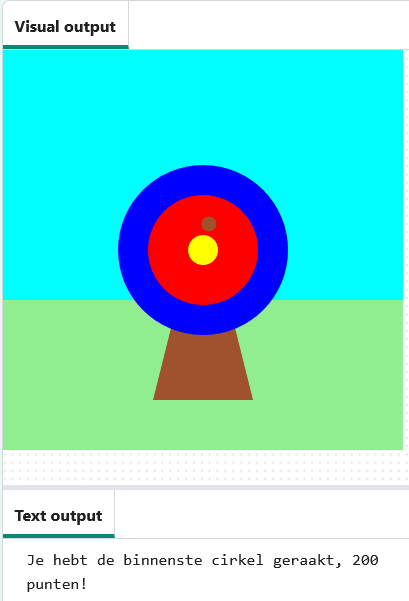

## You will make

Gebruik Python, met de `p5` grafische bibliotheek, om een doel te tekenen en punten te scoren door het met pijlen te raken.

Je gaat:
 + Je spel personaliseren met **RGB-kleuren**
 + **Voorwaardelijke uitspraken** (`if`, `elif`, `else`) gebruiken om beslissingen te nemen
 + Vormen positioneren met **x, y-coördinaten**

--- no-print ---

### Play ▶️

--- task ---

  
Klik op de knop **Run** hieronder om het spel te starten. Wanneer de stip op het doel komt, klik je met de muis (of tik je op je tablet) om je pijl af te schieten. 

Probeer het een paar keer. Je score verschijnt in het uitvoergebied onder het doel. Hoe verandert je score als de pijl op de verschillende kleuren landt? 
  <iframe src="https://trinket.io/embed/python/f686c82d8a?outputOnly=true" width="600" height="560" frameborder="0" marginwidth="0" marginheight="0" allowfullscreen>
  </iframe>

--- /task ---

--- /no-print ---

--- print-only ---

--- /print-only ---

Het oudste bewijs van  boogschieten  komt uit de Sibudu-grot in KwaZulu-Natal, Zuid-Afrika. Er zijn overblijfselen gevonden van pijlpunten van steen en been, die dateren van 60.000 tot 70.000 jaar geleden. 

