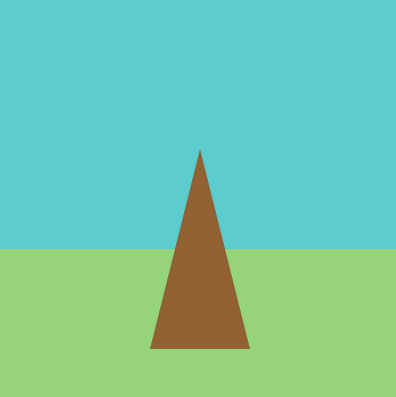
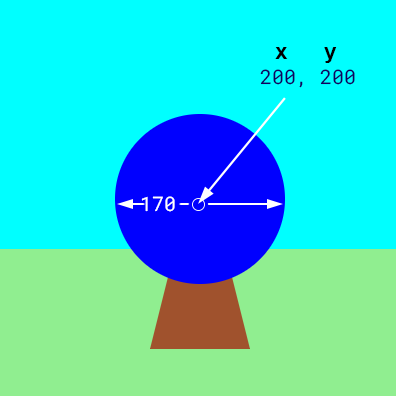

## Teken je doelwit

Your game needs a target to shoot arrows at.

{:width="300px"}

### Draw a triangular stand

--- task ---

Set the fill colour to `sienna` (brown).

Draw a triangle using the x and y coordinates for each of the corners.

{:width="400px"}

--- code ---
---
language: python filename: main.py - draw() line_numbers: true line_number_start: 18
line_highlights: 24-25
---

    fill('lightgreen')  # Set the fill colour for the grass to light green
    rect(0, 250, 400, 150)  # Draw a rectangle for the grass with these values for x, y, width, height
    fill('sienna')  # Brown colour
    triangle(150, 350, 200, 150, 250, 350)  # Draw a triangle for the target's stand

--- /code ---

--- /task ---

--- task ---

**Test:** Voer je code uit om de standaard voor je doelwit te zien.

{:width="400px"}

--- /task ---

### Draw the target circles

--- task ---

**Tip:** Om een cirkel te maken, moeten de **breedte** en **hoogte** gelijk zijn.

Set the fill colour to `blue`.

Draw a circle with x and y coordinates for its centre and a width.

{:width="400px"}

--- code ---
---
language: python filename: main.py - draw() line_numbers: true line_number_start: 33
line_highlights: 31-32
---

    fill(hout) 
      triangle(150, 350, 200, 150, 250, 350) 
      fill(buitenste) 
      ellipse(200, 200, 170, 170) #Buitenste cirkel.

--- /code ---

--- /task ---

--- task ---

**Test:** Voer je code uit om de eerste grote blauwe cirkel te zien.

The blue circle was drawn after the stand so it is in front.

{:width="400px"}

--- /task ---

Het doel is gemaakt van cirkels van verschillende grootte met dezelfde centrale coördinaten (200, 200) - het midden van het scherm.

--- task ---

Maak twee nieuwe variabelen om de kleuren voor de resterende `binnenste` en `roos` cirkels op te slaan.

--- code ---
---
language: python filename: main.py - draw() line_numbers: true line_number_start: 28
line_highlights: 33-34
---

    fill('sienna')  # Brown colour
    triangle(150, 350, 200, 150, 250, 350)  # Draw a triangle for the target's stand 
    fill('blue')  # Set the circle fill colour to blue
    circle(200, 200, 170)  # Draw the outer circle
    fill('red')  # Set the colour for the circle fill to red
    circle(200, 200, 110)  # Draw the inner circle using x, y, width
    fill('yellow')  # Set the colour for the circle fill to yellow      
    circle(200, 200, 30)  # Draw the middle circle using x, y, width

--- /code ---

--- /task ---

--- task ---

**Debuggen:** Python gebruikt de Amerikaanse spelling van 'color' (zonder een 'u'), dus zorg ervoor dat jij dat ook doet.

{:width="400px"}

--- /task ---

--- task ---

**Test:** Voer je project opnieuw uit om het doel met drie gekleurde cirkels te zien. Verander de kleuren totdat je er tevreden mee bent. You can find a list of all of the available colour names on [W3 Schools](https://www.w3schools.com/colors/colors_names.asp){:target="blank"}.

{:width="400px"}

--- collapse ---
---
title: Example code using different colours
---

--- code ---
---
language: python filename: main.py - draw() line_numbers: true line_number_start: 31
line_highlights: 37-40
---

def draw():
# Things to do in every frame

    fill('BlueViolet')
    rect(0, 0, 400, 250)  # Sky
    fill('DeepSkyBlue')
    rect(0, 250, 400, 150)  # Ground
    fill('FireBrick')
    triangle(150, 350, 200, 150, 250, 350)  # Stand
    fill('LemonChiffon')
    circle(200, 200, 170)  # Outer circle
    fill('DeepPink')
    circle(200, 200, 110)  # Inner circle
    fill('BlueViolet')
    circle(200, 200, 30)  # Middle circle

--- /code ---

--- /collapse ---

--- /task ---

--- save ---
