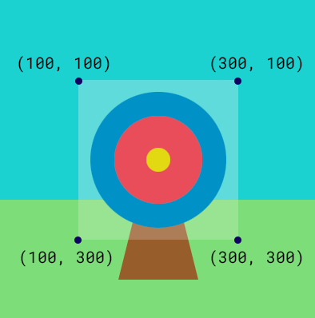

## Пусти стрілу

Коли ти будеш натискати або торкатися, стріла буде вистрілювати в місці розташування рухомого круга-мішені. 

{:width="300px"}

### Намалюй коло для мішені для кожного кадра

 Комп'ютери створюють ефект руху, показуючи зображення одне за одним. Кожне зображення має назву  кадр.   

--- task ---

Визнач свою функцію `shoot_arrow()` під коментарем **# Функція shoot_arrow викликається тут**.

Додай код, щоб випадковим чином з'являвся коричневий кружок всередині мішені:

--- code ---
---
language: python filename: main.py — shoot_arrow() line_numbers: true line_number_start: 9
line_highlights: 10, 11, 12, 13, 14
---
# Функція shoot_arrow викликається тут
def shoot_arrow():   
arrow_x = randint(100, 300) # Зберігання випадкового числа в діапазоні від 100 до 300    
arrow_y = randint(100, 300) # Зберігання випадкового числа в діапазоні від 100 до 300    
fill(wood) # Встановлення кольору заливки стріли на wood   
circle(arrow_x, arrow_y, 15) # Намалювати маленьке коло на випадкових координатах

--- /code ---

--- /task ---

--- task ---

Перейди до функцій `draw` та зроби виклик твоєї нової функції `shoot_arrow`.

--- code ---
---
language: python filename: main.py — draw() line_numbers: true line_number_start: 42
line_highlights: 44
---

    fill('yellow')  # Set the colour for the circle fill to yellow      
    circle(200, 200, 30)  # Draw the middle circle using x, y, width
    shoot_arrow()

--- /code ---

--- /task ---

--- task ---

**Test:** 🔄 Run your code and see the arrow appear in a random position each frame.

The background and target will be drawn over the old arrow. This means you only see one arrow at a time.

--- /task ---

### Визнач колір, на який потрапила стріла

The `get()` function returns the colour of a pixel.

A pixel, short for picture element, is a single coloured dot within an image. Images are made up of lots of coloured pixels.

--- task ---

Add a **global variable** called `hit_colour` that can be used throughout your code.

Add code to `get` the colour of the pixel at the centre of the arrow and store it in the `hit_colour` variable. In order to compare the colours, we need to use the hexadecimal code. This can be done with the `.hex` string.

--- code ---
---
language: python filename: main.py — shoot_arrow() line_numbers: true line_number_start: 9
line_highlights: 13
---
# Функція shoot_arrow викликається тут
def shoot_arrow():    
arrow_x = randint(100, 300)    
arrow_y = randint(100, 300)    
hit_color = get(arrow_x, arrow_y) # Визначити, в який колір влучено fill(wood)  
circle(arrow_x, arrow_y, 15)

--- /code ---

**Порада:** 💡 Код для визначення кольору `get` повинен бути **перед** кодом, який малює коло `circle`, інакше колір wood для стріли збережеться назавжди!

--- /task ---

### Виведення кольору, коли натиснута кнопка миші

Бібліотека `p5` 'слухає' та реагує на певні події, однією з яких є натискання кнопки миші. Коли буде виявлено, що кнопка натиснута, буде виконано той код, який було задано у функції `mouse_pressed`.

--- task ---

Визнач свою функцію `mouse_pressed()` під коментарем **# Функція mouse_pressed викликається тут**.

Додай код, щоб надрукувати кількість червоного, зеленого та синього кольорів у пікселі, на який потрапляє стріла.

--- code ---
---
language: python filename: main.py - mouse_pressed() line_numbers: true line_number_start: 7
line_highlights: 8, 9
---

# Функція mouse_pressed викликається тут
def mouse_pressed():    
print( red(hit_color), green(hit_color), blue(hit_color) )

--- /code ---

--- /task ---

--- task ---

Зроби `hit_color` **глобальною змінною**, щоб її можна було використовувати для всього твого коду:

The project prints 🎯 each time the arrow is redrawn.

def shoot_arrow():    
global hit_color # Можна використовувати в інших функціях     
arrow_x = randint(100, 300)     
arrow_y = randint(100, 300)     
hit_color = get(arrow_x, arrow_y) # Збереження кольору перед малюванням стріли fill(wood)     
circle(arrow_x, arrow_y, 15)

**Debug:** 🐞 Check the `print` line really carefully for commas and brackets.

--- /task ---

--- save ---
